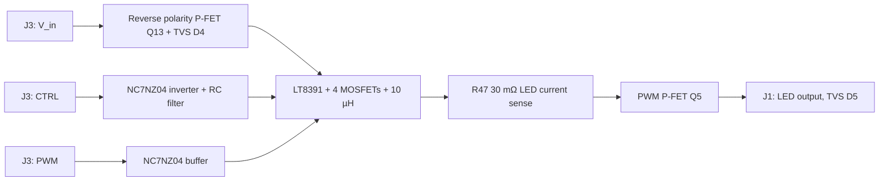

# AIO Power Supply (LT8391 buck-boost)

[](https://doi.org/10.5281/zenodo.22992267) [](LICENSE) [](CITATION.cff)

An all-in-one buck-boost power supply: adjustable constant current with a fixed constant-voltage
limit, for LEDs and other DC loads.

Universelles Buck-Boost-Netzteil mit einstellbarem Konstantstrom und Spannungsbegrenzung (LT8391).

## Safety and disclaimer

This is a hobby project, not a certified product. The board handles up to about 60 V input and
3.3 A output current; wrong wiring, a missing heat sink or a short circuit can cause fire, burns
and damage. High-power LEDs at full current are very bright: do not look into them directly.
No warranty, see the license.

## What it is

A small 50 × 50 mm board that supplies a DC load with a regulated constant current up to a fixed maximum voltage. Because the LT8391 is a four-switch buck-boost controller, the output voltage can be below, equal to or above the input voltage, so one board covers single LEDs, longer LED strings and other loads. The current is set by an external control signal and the output can be switched with PWM. There is no firmware; the board is controlled via two logic inputs.

Two board revisions exist. V1 uses Molex Micro-Fit connectors (43045) and DF2B6 ESD diodes. V2 is the current version and is described below.

## Key data (V2)

Values marked *calculated* follow from the component values in the schematic and typical figures from the LT8391 datasheet. Of these, only the full-scale LED current has a bench measurement.

| | |
|---|---|
| Controller | LT8391EFE, synchronous 4-switch buck-boost LED controller |
| Power stage | 4 × PSMN013-60YLX (60 V N-MOSFET), L1 = 10 µH (Coilcraft XAL1510-103) |
| Topology | buck, buck-boost or boost, depending on V_in and V_LED |
| Input voltage | approx. 4 V to 60 V (UVLO calculated below; upper limit from the LT8391's 60 V rating, the 60 V MOSFETs and TVS and the 63 V input capacitors) |
| Max output current | 3.33 A (*calculated*, 100 mV / 30 mΩ). measured: 3.3 A (see [`docs/measurements.md`](docs/measurements.md)) |
| Regulation | constant current (CC, set via CTRL) with constant-voltage limit (CV, fixed by FB divider); automatic crossover |
| Max output voltage | approx. 48 V (*calculated*, CV level set by the FB divider) |
| Current setting | CTRL input, PWM or DC logic signal, filtered to an analog voltage (see below) |
| Dimming | PWM input, series P-MOSFET Q5 disconnects the LEDs |
| Protection | reverse polarity P-FET (DMP6180SK3), TVS 60 V on input and output (PTVS60VS1UR), 5 V ESD diodes on the logic inputs, output voltage limit (CV) |
| Connectors | 2 × Molex Mini-Fit Jr. 39-28-1043 (2 × 2 pins) |
| PCB | 4 layers, 50 × 50 mm, EAGLE 7.7 |

### Derivations

**LED current.** The LT8391 regulates the voltage across the LED current sense resistor (ISP–ISN, R47 = 30 mΩ in series with the LED output) to 100 mV at full scale:

I_LED,max = 100 mV / 30 mΩ = 3.33 A (*calculated*)

**Current setting (CTRL1).** The CTRL input on J3 goes through a 10 kΩ series resistor with ESD diode, is pulled up to INTVCC (100 kΩ) and inverted by one gate of the NC7NZ04. The inverter output is divided and filtered by R11 = 24.9 kΩ, R10 = 10 kΩ and C5 = 4.7 µF:

V_CTRL1 = V_INTVCC × 10 / (24.9 + 10) ≈ 5 V × 0.287 ≈ 1.43 V when the inverter output is high (*calculated*, INTVCC = 5 V)

Filter time constant: (24.9 kΩ ∥ 10 kΩ) × 4.7 µF ≈ 34 ms (*calculated*).

So the CTRL input acts as a PWM-to-analog input: with a duty cycle D (high time) at the input, V_CTRL1 ≈ 1.43 V × (1 − D). An open or high input gives 0 V (LED current off), a low input gives about 1.43 V, which is above the LT8391's full-scale CTRL range, i.e. 3.33 A. In between, the LED current follows the LT8391's CTRL transfer curve (off below about 0.25 V, approximately linear up to full scale; see the datasheet). CTRL2 is tied to VREF and not used.

**PWM dimming.** The PWM input on J3 has the same protection and a 100 kΩ pull-up (open input = LEDs on), is buffered by two inverters of the NC7NZ04 in series and drives the LT8391 PWM pin. The LT8391 switches the P-MOSFET Q5 (PWMTG) in series with the LED output.

**Constant-voltage limit (CV).** The LT8391 has two regulation loops: the current loop (ISP–ISN) and the voltage loop (FB). The loop that asks for less output wins. With a load that would draw more than the set current, the board runs in constant current; when the output voltage reaches the FB level, it runs in constant voltage (like a lab supply with current limit). There is no mode switch: the change between CC and CV is automatic. The CV level is fixed by the FB divider R41 = 43 kΩ / R42 = 910 Ω and the FB regulation voltage of 1.00 V:

V_OUT,max = 1.00 V × (1 + 43 kΩ / 910 Ω) ≈ 48 V (*calculated*)

**Input undervoltage lockout.** EN/UVLO divider R3 = 499 kΩ / R4 = 221 kΩ, with an EN/UVLO threshold of about 1.2 V:

V_IN,UVLO ≈ 1.2 V × (1 + 499 kΩ / 221 kΩ) ≈ 4 V (*calculated*, the datasheet adds a small hysteresis)

**Inductor current sense.** R44 = 4 mΩ between the input half bridge and L1 (LSP/LSN) sets the switch current limit of the LT8391; the resulting limit depends on the datasheet's buck and boost sense thresholds.

**Switching frequency.** Set by R39 = 309 kΩ on RT (see the RT table in the LT8391 datasheet); spread spectrum is disabled (SYNC/SPRD to GND).

### Connectors

| J3 (input) | | J1 (LED output) | |
|---|---|---|---|
| 1 | PWM (dimming, open = on) | 1, 2 | LED + |
| 2 | V_in + | 3, 4 | GND (LED −) |
| 3 | CTRL (current setting, open = off) | | |
| 4 | GND | | |

## Block diagram



## Contents

```
hardware/pdf/           schematic and board layout of V2 as PDF
hardware/pdf/v1/        V1 schematic and V1 draft schematic as PDF
hardware/bom/           bill of materials V2
docs/measurements.md    bench measurement, input current vs. output voltage
```

The board PDF shows the layer view from EAGLE.

## License

- Everything in this repository (hardware, documentation, measurement data): **CC BY 4.0**, see [`LICENSE`](LICENSE).

You may use, change and share everything, also commercially. When you pass it on or
publish something based on it, credit it as:

> Johannes Stockhammer, "AIO Power Supply (LT8391 buck-boost)", version 1.0.0, Zenodo, https://doi.org/10.5281/zenodo.22992267

GitHub shows the same citation under "Cite this repository" (from [`CITATION.cff`](CITATION.cff)).

## Trademarks

LT8391 is a product of Analog Devices (Linear Technology). Molex, Coilcraft and EAGLE are trademarks of their respective owners, used only to identify parts and tools.

## Author

Johannes Stockhammer

Concept, hardware design and documentation by Johannes Stockhammer. Translation and documentation were refined with the help of AI tools and reviewed by the author.
